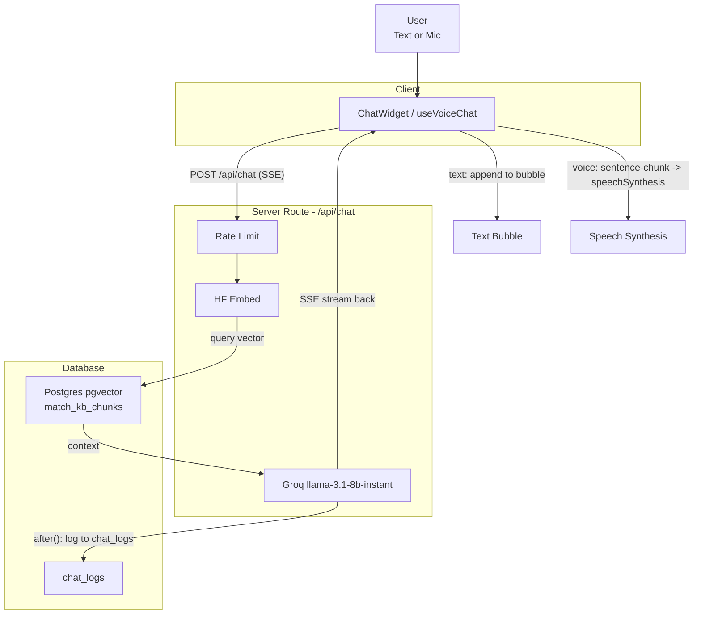

# RAG Pipeline Architecture

Here's the full pipeline, end to end, as it's actually built in this repo.

## 1. Embedding Model
**Choice**: `sentence-transformers/all-MiniLM-L6-v2` via Hugging Face's hosted Inference API (not a local model, not OpenAI).

- **Usage**: Called over HTTP from both the seed scripts and the chat route (`getEmbedding()` in `src/app/api/chat/route.ts:57` and `scripts/seed-rag.mjs:27`).
- **Output**: Produces 384-dimensional vectors — cheap, fast, "good enough" for a small portfolio KB rather than a large-dimension model like `text-embedding-3-large`.
- **Tradeoffs**: Free tier, but adds network latency per chat turn (an extra round trip before retrieval even starts) and is a second point of failure alongside the LLM call. The code explicitly treats embedding failure as non-fatal (`embeddingFailed` flag) rather than 500ing.

## 2. Vector Store
**Choice**: Postgres + `pgvector` on Supabase — no dedicated vector DB (Pinecone/Weaviate/Qdrant).

- **Schema**: `kb_chunks(id, content, metadata jsonb, embedding vector(384))` (defined in `scripts/setup.sql`).
- **Retrieval**: A Postgres function, `match_kb_chunks(query_embedding, match_threshold, match_count)`, using cosine distance (`<=>` operator) converted to similarity (`1 - distance`), filtered by threshold, ordered, limited.
- **Execution**: Called from the API route as a single parameterized query: `SELECT ... FROM match_kb_chunks($1::vector, $2, $3)` — top 20 chunks (effectively the whole KB, since MiniLM's average-pooled embeddings don't discriminate precisely across ~20 short, lexically-similar bio sentences; retrieval's real job at this KB size is screening out off-topic questions via the threshold, not precision ranking), threshold defaults to `0.15` but is overridable via `RAG_SIMILARITY_THRESHOLD` env var.
- **Efficiency**: Reuses the same Postgres connection (pg Pool) that's already needed for logging, so there's no second database/service to run.

## 3. Knowledge Base Content & Seeding
Two duplicate seeding paths, both hardcoding the same 10 chunks of biographical/portfolio text about Keerthana (stack, experience, education, contact info, projects):

- **Local Script** (`scripts/seed-rag.mjs`): Node script, run manually with `DATABASE_URL` / `HF_TOKEN` env vars, checks the table exists first, inserts one row at a time with a 1s delay to respect HF free-tier rate limits.
- **Production Endpoint** (`src/app/api/seed/route.ts`): An HTTP GET endpoint that does schema DDL + TRUNCATE + re-seed in one shot, meant to be hit once against production (Vercel) so it uses whatever env vars are set there.

*Note: This is inline, static content — not a document ingestion/chunking pipeline (no PDF/markdown parsing, no chunk-size/overlap logic). Reasonable for ~10 facts; would need a real chunker if the KB grew.*

## 4. Retrieval-Augmented Generation (The API Route)
**Flow per request** (`src/app/api/chat/route.ts`):

1. **Rate limit**: In-memory Map keyed by IP, 10 requests/60s window (resets on server restart/cold start — fine for a portfolio, not for multi-instance scaling).
2. **Embed the query**: Same HF call as seeding. If it fails, skip straight to a graceful fallback message rather than erroring.
3. **Retrieve**: Query `match_kb_chunks` for top-5 chunks above the similarity threshold.
   - **Zero matches** → Return a canned "I don't have specifics on that" fallback without ever calling the LLM (saves a Groq call for genuinely out-of-scope questions).
   - **DB error** → Degrade to no-context generation rather than failing the request.
4. **Generate**: Groq's `llama-3.1-8b-instant`, streamed. System prompt is heavily engineered for tone/persona:
   - Never mention "context"/"retrieval"/"internal mechanics".
   - Say "Keerthana" once, then switch to pronouns (with a worked correct/incorrect example baked into the prompt).
   - Default to plain sentences; only use bullets/headings for genuinely listable content.
   - If the LLM call itself fails (rate-limited, down), fall back to a canned apology + email pointer.
5. **Stream back**: Hand-rolled SSE (`data: {"content": "..."}\n\n` frames, no `[DONE]` sentinel — the stream just closes).
6. **Log (Fire-and-Forget)**: Every turn (text or voice) is written to a `chat_logs` table via Next's `after()` so it runs post-response and can never slow down or break the actual reply. Captures whether retrieval succeeded and how many chunks matched, explicitly to let you audit retrieval quality later.

*Why Groq specifically: free/cheap, very fast token-generation speed, which matters a lot for the voice path (see below) where latency directly affects how quickly the assistant starts speaking.*

## 5. Chat Frontend (ChatWidget.tsx)

- **UI Layout**: Single floating widget, draggable, with a mobile (centered modal) and desktop (anchored popover) layout sharing one render function.
- **SSE Parsing**: Manual SSE parsing on the client: buffers chunks, splits on `\n\n`, parses each `data:` line as JSON, appends to the streaming message in place.
- **Controls**: Hard cap of 6 exchanges per session (`exchangeCount`) — a cost/abuse control on top of the server-side rate limit.
- **Rendering**: Lightweight custom markdown-ish renderer (`formatMessageText`) for bold, links, headings, bullets — no markdown library dependency.
- **Contact Convention**: A `[CTA_CONTACT]` marker convention: the LLM can emit this token and the client swaps it for the actual email string — keeps the email out of the prompt-visible completion while still letting the model "decide" when to surface it.

## 6. Voice Chat (No Separate Service)
This is the more interesting design decision: voice is not a separate pipeline, it's the identical `/api/chat` endpoint with `source: "voice"`, layered with browser-native STT/TTS:

- **Speech-to-Text (STT)**: Web Speech API (`SpeechRecognition`) — client-side, free, no Whisper/Deepgram call. Interim + final transcripts drive a reducer-based state machine (idle → listening → processing → speaking).
- **Text-to-Speech (TTS)**: `speechSynthesis` — also client-side/free. Sentences are extracted from the streaming SSE text as soon as a `.`, `!`, or `?` boundary appears (`extractSentences`) and queued for speech incrementally, so the bot starts talking before the full LLM response has finished streaming — this is the main latency optimization in the whole voice path.
- **Voice Selection**: Voice picking is a best-effort preference list (Natural Microsoft voices, Google, Samantha) since the Web Speech API can't be told which voice to use directly, only asked for what's installed.
- **Pronunciation**: A pronunciation override table respells "Keerthana" phonetically for TTS only (captions still show correct spelling), since SSML isn't supported by this API.
- **Edge Cases**: Handles ~17 documented edge cases inline (barge-in/interrupt while bot is speaking, mic permission denied, no mic hardware, double-start guard, unmount mid-session, rate-limit 429 needing to be spoken not just logged, etc.) — all via refs + a single `endSession` exit path so there's one way to reach idle.
- **Transcript Integration**: Completed voice turns are reported up via `onExchange` and appended to the same message list `ChatWidget` uses for text — so the transcript is unified regardless of input mode.

## Overall Architecture Shape

> Everything is chosen to run on free/cheap tiers with no dedicated infra: Supabase Postgres doubles as vector store + log store, Groq for fast/cheap inference, HF hosted inference for embeddings, and the browser itself for STT/TTS — the only "server cost" is the two HTTP calls (embed + generate) per turn.
