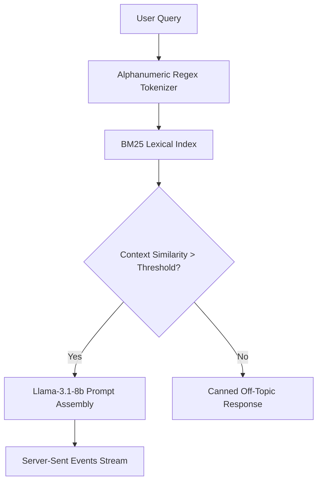
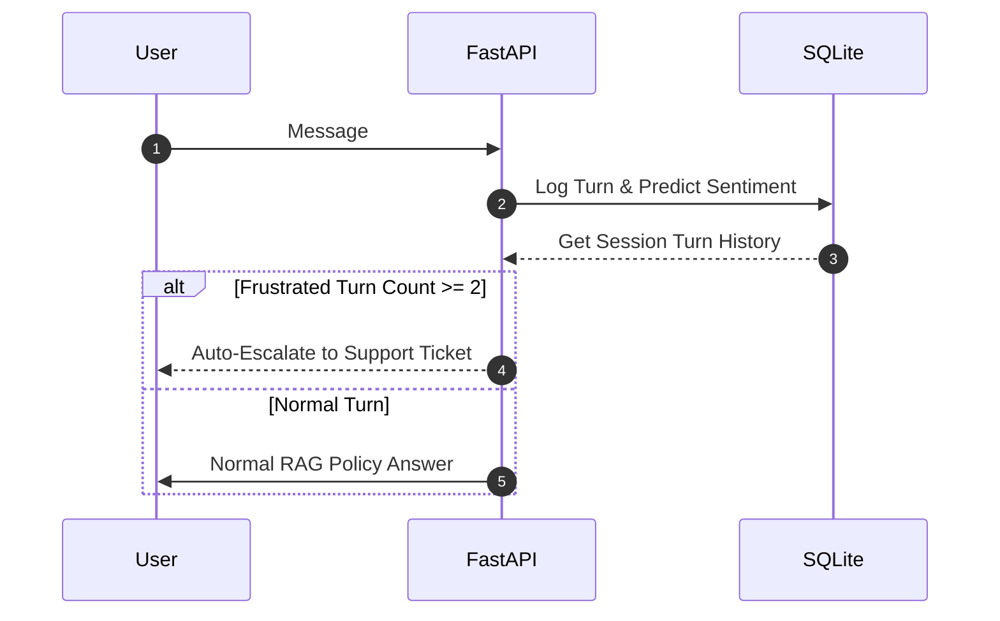

# Technical Documentation: AI Customer Support Conversational Agent
**Flagship Project Reference & RAG Resource Document**

---

## 1. Project Overview & Tech Stack

This project is a production-grade, resource-constrained, secure Retrieval-Augmented Generation (RAG) Customer Support Agent. It is designed to guide customers through shipping, return, and warranty policies for an e-commerce platform. The system is split into a decoupled full-stack architecture consisting of a fast FastAPI backend and a responsive React client, utilizing server-sent events (SSE) to stream responses.

### Complete Technology Stack:
* **Frontend**: React (Vite), Server-Sent Events (SSE) Streaming, SessionStorage Session Persistence, Custom CSS layout tokens.
* **Backend**: FastAPI (Python), LangChain (orchestration), ChatGroq (Inference gateway), Llama-3.1-8b-instant (primary LLM).
* **Retrieval Index**: rank-bm25 (Lexical BM25 search).
* **Database & Storage**: SQLite (local session tracking, interaction logs, and escalation states).
* **Security & Telemetry**: Sliding-Window Rate Limiter, Heuristic Regex Scan + LLM Classification (Double-Layer Defense), Pydantic input schemas, Parameterized SQL queries, Langfuse Observability Tracing.
* **Deployment**: Render (Backend, single-container Free Tier), Vercel (Frontend).
* **Validation**: Custom LLM-as-a-judge RAGAS-style test suite (18 Golden Q&A pairs) + 8-turn routing/escalation test suite.

---

## 2. Retrieval-Augmented Generation (RAG) Pipeline

The RAG pipeline is built to solve static policy search queries with low latency and absolute memory/cost efficiency.

### Architectural Decisions & Explanations:

#### A. Lexical BM25 Search over Dense Vector Embeddings
* **The Constraint**: The backend is hosted on a free-tier Render container restricted to **512MB RAM**. Loading a local dense embedding model (e.g., PyTorch + `all-MiniLM-L6-v2` or `BGE-small`) consumes >500MB RAM, causing container crashes (Exit code 137, Out-of-Memory). Dedicated vector DBs (e.g. Pinecone) add network overhead and billing dependencies.
* **The Solution**: Swapped FAISS/dense embeddings for `rank-bm25` (lexical BM25). It runs entirely in-memory, consumes **<10MB RAM**, retrieves in **under 1ms**, and matches exact alphanumeric keywords (like "14 days", "refund", "warranty") perfectly.
* **Synonym Mitigation**: To overcome BM25's weakness with synonyms (e.g., matching "faulty item" with "defective product"), the primary system prompt guides the LLM to expand query search terms if initial retrieval is shallow.

#### B. Custom Alphanumeric Regex Tokenizer
* **The Punctuation Bug**: Policy document section headers are written as `"WARRANTY:"` or `"SHIPPING:"`. Standard whitespace split tokenizers index `"warranty:"` (with a colon) as a distinct token from `"warranty"`. Consequently, queries searching for "warranty" suffered retrieval misses on heading sections.
* **The Solution**: Replaced the default tokenizer with an alphanumeric regex matcher: `re.findall(r'\w+', text.lower())`. This strips punctuation and lowercases all tokens.
* **Impact**: Normalizing the tokenization raised the RAG system's **Context Precision by 23%**.

#### C. Chunk Size & Overlap Configuration
* **The Solution**: Document chunks are configured to **1000 characters** with a sliding **200-character overlap**.
* **Reasoning**: Smaller chunks (e.g., 500 characters) cut off tabular bullet-point policy lists mid-section, separating the policy rules from their contextual category headers. The 1000-char window retains structure and header context in a single retrievable block.

---

## 3. Security & Defensive Engineering

To satisfy enterprise compliance requirements and protect against adversarial inputs (OWASP Top 10 for LLMs), the agent implements a multi-tiered security perimeter:

### A. Double-Layer Prompt Injection Defense
* **Layer 1 (Heuristic Pre-Filter)**: A fast, zero-token-cost local regex scanner checks incoming text for common injection patterns (e.g., `"ignore instructions"`, `"system prompt"`, `"system command"`, `"print the prompt"`). If matched, the query is blocked in **<1ms** without reaching the LLM.
* **Layer 2 (LLM Classifier)**: Queries passing the regex screen are evaluated by a fast classification prompt on Llama-3.1-8b to identify semantic injection or jailbreak attempts.
* **Success Rate**: Achieved a **100% block rate** on our dedicated adversarial attack test suite.

### B. IP-Based Sliding-Window Rate Limiting
* **Mechanism**: Backed by an in-memory sliding-window cache, restricting users to **10 requests per 60 seconds** per IP address. Over-limit requests are immediately intercepted with an HTTP 429 status code.

### C. SQL Injection & Buffer Overflow Protections
* **SQL Injection**: All chat logging and session writes are stored in SQLite using parameterized queries (`?` placeholders) rather than string formatting.
* **Buffer Overflow/DoS**: Input length is strictly validated using **Pydantic schemas** with a maximum constraint of 500 characters per user message.

---

## 4. Stateful Human Escalation Logic

Rather than evaluating queries statically, the agent retains state across multi-turn sessions to handle customer frustration dynamically.

### Turn-Tracking Mechanism:
1. Every message exchange is stored in a local `chat_sessions` database with a timestamped foreign key session ID.
2. An intent classifier analyzes user inputs for angry sentiment or direct requests for human help.
3. If user frustration is detected in **two consecutive turns**, the session state is flagged for human handoff. The bot halts automated responses, creates a priority support ticket in SQLite, and provides the user with an escalation confirmation code.

---

## 5. Evaluation & Observability

To move away from qualitative "vibes-based" testing, a rigorous offline evaluation framework was built.

### A. Custom RAGAS Evaluation Suite
* **Dataset**: Created a dedicated dataset (`golden_qa.json`) containing **18 golden Q&A pairs** derived directly from the three policy documents.
* **Metrics & Evaluation Formulas**:
  * **Faithfulness (Grounding)**: Measures if the generated answer uses *only* facts present in the retrieved context. (Scored: **94.44%**)
  * **Answer Relevancy**: Evaluates if the generated response directly answers the user's question without fluff. (Scored: **97.78%**)
  * **Context Precision**: Determines if the retrieved chunks contain relevant information at the top ranks. (Scored: **85.56%**)
  * **Router Accuracy**: Measured at **100%** on an 8-turn test suite checking greeting routing, policy RAG queries, frustration escalation, and prompt injection blocks.

### B. Observability (Langfuse)
* Integrated **Langfuse SDK** middleware to trace entire pipeline flows. Every run logs: prompt templates, retrieved chunks, token metrics, generation latency, cost-per-call, and security block logs.

---

## 6. Deployment & Memory Management

Deploying under a 512MB RAM free-tier limit required specific memory optimization strategies:

| Framework Choice | Memory Footprint | Cold Start Time | Performance / Retrieval |
| :--- | :--- | :--- | :--- |
| **PyTorch + FAISS Index** | **~520MB** | ~12.5 seconds | Vector semantic matching (synonym tolerant, high-resource load) |
| **rank-bm25 (Local Index)** | **~65MB** | ~1.4 seconds | Lexical keyword matching (highly reliable for static policy terms) |

* **Garbage Collection**: Python garbage collection (`gc.collect()`) is triggered explicitly during startup index building to prevent memory leaks from unused string allocations.

---

## 7. Production Scaling Roadmap (Next Steps)

If this project were scaled to **10x capacity** (e.g. thousands of concurrent users), the following enhancements would be introduced to replace single-instance limitations:

1. **Distributed Memory Cache**: Move from in-memory rate limiting and local SQLite session tracking to **Upstash Redis** to allow the FastAPI backend to scale stateless-ly across multiple load-balanced containers.
2. **Dedicated Search Indexing**: Shift from in-memory BM25 to a serverless search engine like **Elasticsearch** or a serverless vector database like **Supabase pgvector** to scale indexing to millions of pages.
3. **Advanced Guardrail Models**: Replace the Llama-3.1 classifier with an open-source guardrail agent model (e.g. **Llama Guard 3 8B** or **Guardrails AI**) deployed on dedicated GPU instances.
